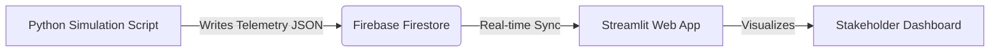

# Operational Digital Twin PoC


A Proof of Concept for an Industrial Digital Twin, demonstrating Operational Intelligence (OI) and Business Intelligence (BI) using Simulated Edge Data.

## 🚀 Live Demo
**[Launch Dashboard](https://prescientdemos.web.app)** (After CI/CD deployment completes)

## 🏗️ Architecture
*   **Edge**: Python Simulator (`simulator.py`) genrating telemetry.
*   **Cloud**: Firebase Firestore (NoSQL Database).
*   **App**: Streamlit Dashboard hosted on Google Cloud Run.
This project aims to build a Minimum Viable Product (PoC) of an **Operational Digital Twin** for Analytical Instrumentation, inspired by the Prescient Devices customer story. The goal is to demonstrate how "Edge" data (simulated) can be transformed into actionable Operational Intelligence (OI) and Business Intelligence (BI) for stakeholders.

## 2. Feasibility Analysis
*   **Feasible**: Yes.
*   **Why**: The architecture uses standard, well-integrated tools. Python allows for robust simulation of hardware signals ("Edge"). Firebase Firestore provides the real-time NoSQL database capabilities required to stream this data. Streamlit is widely used for rapidly building interactive data dashboards that can visualize this real-time stream.
*   **Constraint Handling**:
    *   **"No External Systems"**: We will create a Python-based `DigitalTwinSimulator` class to generate realistic telemetry (e.g., spectrometer readings, status changes, error codes) without connecting to real OT hardware.
    *   **"Firebase"**: Used as the central message broker and state store, decoupling the simulator from the dashboard.

## 3. Architecture



### 3.1 Components
1.  **Edge Simulator (Python)**:
    *   Simulates a fleet of "Analytical Instruments" (e.g., Mass Spectrometers, Chromatographs).
    *   Generates data points: `device_id`, `timestamp`, `status` (Idle, Running, Error, Maintenance), `utilization_rate`, `operator_id`, `error_code`, `sample_throughput`.
    *   Push frequency: Every 2-5 seconds to mimic real-time.

2.  **Data Layer (Firebase)**:
    *   **Firestore Collection**: `telemetry_stream` (Time-series data).
    *   **Firestore Collection**: `device_registry` (Static metadata: Device Location, Model, Commission Date).

3.  **Frontend (Streamlit)**:
    *   **OI View (Operational)**: Real-time status of the fleet. Active vs. Idle devices. Map view (optional) or Grid view of device health.
    *   **BI View (Business)**: Aggregated "Lab Insights". Utilization trends over time. projected revenue impact (simulating the "SaaS" value). Operator efficiency scores.

## 4. Feature Specification

### 4.1 Simulator Features
*   **Multi-Device Simulation**: Configurable number of devices (default: 5).
*   **Scenario Injection**: Ability to inject "failures" or "spikes" to demonstrate alert handling.
*   **Data Structure**:
    ```json
    {
      "device_id": "INST-001",
      "model": "Spectro-X200",
      "timestamp": "2023-10-27T10:00:00Z",
      "metrics": {
         "temperature": 45.2,
         "vibration": 0.04,
         "throughput": 12
      },
      "status": "RUNNING",
      "operator": "OP-42"
    }
    ```

### 4.2 Application Features
*   **Dashboard Header**: Global summary (Total Active, Average Utilization, Active Alerts).
*   **Real-time Monitor**: Auto-refreshing charts showing the last 15 minutes of live data.
*   **Drill-down**: Click a device ID to see its specific history and "Predicted Maintenance" score.
*   **Business ROI Calculator**: A widget showing "Potential Revenue Gain" based on current utilization vs. target (39% improvement scaling).

## 5. Technology Stack
*   **Language**: Python 3.9+
*   **UI Framework**: Streamlit
*   **Database**: Google Firebase Firestore
*   **Libraries**: `streamlit`, `firebase-admin`, `pandas`, `plotly` (for advanced charting), `faker` (for generating synthetic data).

## 6. Project Structure
```text
/
├── main.py                 # Streamlit App Entry point
├── simulator.py            # Standalone script to generate traffic
├── firebase_config.py      # Connection logic
├── requirements.txt        # Dependencies
├── .gitignore
├── firebase_key.json       # (To be added safely)
└── README.md
```

## 7. Implementation Plan
1.  **Setup**: Initialize Python environment and Firebase credentials.
2.  **Backend**: Write `simulator.py` to push dummy data to Firestore.
3.  **Frontend**: Create basic Streamlit layout connecting to a single data stream.
4.  **Refinement**: Add the specialized OI and BI charts.
5.  **Docs**: Write instructions on how to run the simulator and the app simultaneously.
